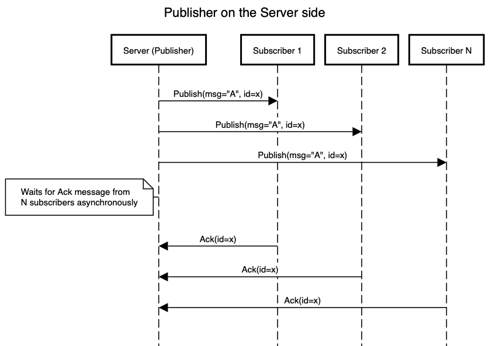
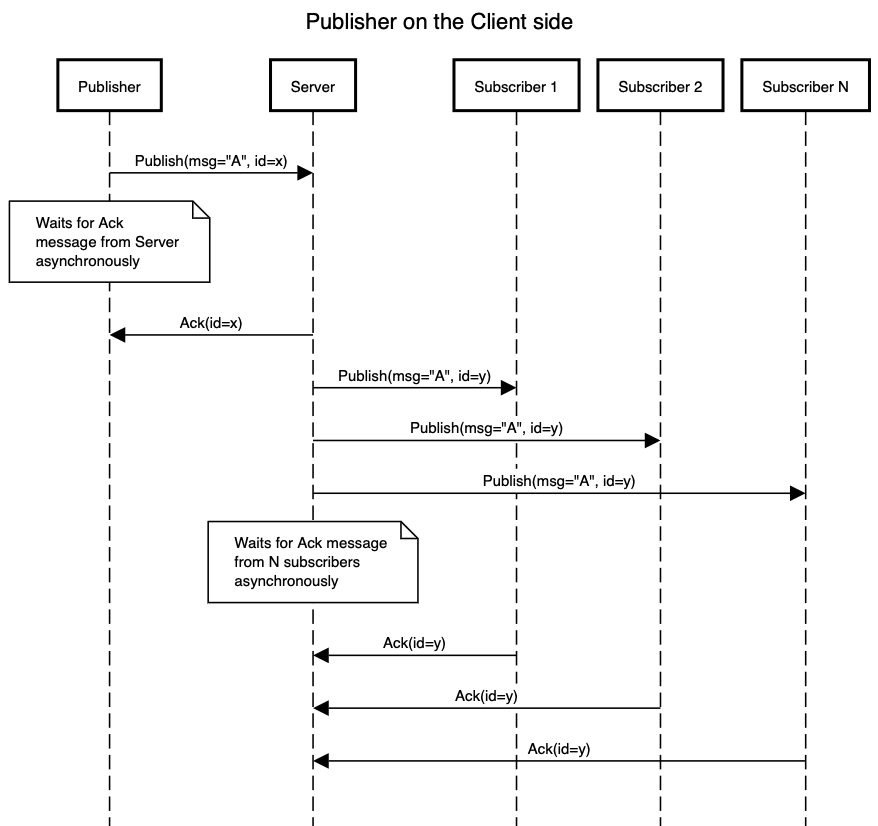

# PubSub

A simple PubSub support is added in 0.8.0. A simple example can be found [here](https://github.com/minghuaw/toy-rpc/tree/main/examples/tokio_pubsub).

A publisher can be created on the server side or the client side using the `publisher::<T: Topic>()` method, and a subscriber can be created using the `subscriber::<T: Topic>(cap: usize)` method. They both take one type parameter `T` that must implements the `toy_rpc::pubsub::Topic` trait. You can use the provided derive macro `#[derive(toy_rpc::macros::Topic)]` to define a struct as the pubsub message or by manually implementing the `toy_rpc::pubsub::Topic` trait on a type.

```rust,noplaypen
use toy_rpc::macros::Topic;
use serde::{Serializer, Deserialize};

#[derive(Topic, Serialize, Deserialize)]
pub struct Count(pub u32);
```

Or manually implement the `Topic` trait

```rust,noplaypen
#[derive(Serialize, Deserialize)]
pub struct Count(pub u32);

impl toy_rpc::pubsub::Topic for Count {
    type Item = Count; // The Item type must implement `Serialize` and `Deserialize`

    // A String identifier for the topic. The user must ensure it is unique
    fn topic() -> String {
        "Count"
    }
}
```

A publisher can be created by specifying the topic in the type parameter.

```rust,noplaypen 
let publisher = client.publisher::<Count>(); // on client side
// let publisher = server.publisher::<Count>(); // on server side
```

The `Publisher` implements the `futures::Sink<T>` trait where `T` is the type parameter representing the topic. In order to publish message to the topic, the `futures::SinkExt` trait must be imported.

```rust,noplaypen  
use futures::SinkExt;

publisher.send(Count(7)).await.unwrap();
```

A subscriber can be created by specifying the topic in the type parameter and the capacity of its local buffer. Here we will create a subscriber on the client side listening to messages on the topic `Count` with a local capacity of 10.

```rust,noplaypen 
let subscriber = client.subscirber::<Count>(10).unwrap(); // on the client side
// let subscriber = server.subscriber::<Count>(10).unwrap(); // on the server side (except for `actix-web`)
```

The `Subscriber` implements the `futures::Stream<Item = Result<T, toy_rpc::Error>>` trait where `T` is the type parameter representing the topic. In order to process incoming messages, the `futures::StreamExt` trait must be imported.

```rust,noplaypen 
use futures::StreamExt;

if let Some(result) = subscriber.next().await {
    let item = result.unwrap(); // There could be errors recving incoming messages
    // do something with the item
}
```

## Example

[GitHub repo](https://github.com/minghuaw/toy-rpc/tree/main/examples/tokio_pubsub)

## `Ack` for `Publish` message delivery

As of version 0.8.0-beta.0, `Ack` is added in the cases where explicit `Ack` is needed. `Ack` only applies to acknowledge receiving of `Publish` message and does ***NOT*** apply to any RPC requests/responses. There are three different `AckMode`

  1. `AckModeNone`, which is the ***default*** mode for both the `Server` and `Client`. This mode is available on both the `Server` and the `Client` Under this mode, no `Ack` message will be required by the publisher or be sent by the subscriber.
  2. `AckModeAuto`. This mode is available on both the `Server` and `Client`. Under this mode, both the server and the client will automatically reply with an `Ack` to any `Publish` message they receive.
  3. `AckModeManual`. This mode is only available on `Client`. Under this mode, the subscriber needs to manually `.ack()` in order to get the published item. Please note that under the manual mode, the `Publisher` behaves the same as if it is under the `AckModeAuto` mode.


The behavior of publisher/subscriber will be discussed in different senarios below.

1. `Publisher` on the `Server` with `AckModeAuto`

    When a `Publisher` is created on the server side, the server's pubsub handler will wait for ***ALL*** `Ack`s from the subscribers, including that from `Subscriber` on the `Server`, in an asynchronous manner, meaning the publisher is able to continue publishing new messages even if some subscribers have not sent back `Ack` yet. Upon reaching the timeout, the server's pubsub handler will try to resend the same publish message (with the same sequence ID) to the `Subscriber`s that have not send back `Ack` messages. The server will stop retrying after the maximum number of retries is reached.
    
    

2. `Publisher` on the `Client` with `AckModeAuto` or `AckModeManual`

    When a `Publisher` is created on the client side, the client will wait for only ***ONE*** `Ack` message from the `Server` in an asynchronous manner, meaning the `Publisher` is able to continue publishing  new messages even if the `Ack` message from the `Server` has not arrived. If the `Ack` message from the `Server` does not arrive before the timeout expires, the client will attempt to publish the same message (with the same message ID). The client (`Publisher`) will stop retrying after the maximum number of retries is reached. 

    Once the `Publish` message is received by the `Server`, the message will be assigned a new sequence ID that is tracked only by the `Server`. The message will then be published to all subscribers under the topic, and the server will wait for ***ALL*** `Ack` messages from the subscribers in an asynchronous manner, meaning the server will be able to keep handling RPC requests or PubSub messages while waiting for `Ack` messages to come back. If not all `Ack` messages are sent back to the server before the timeout expires, the server will attempt to resend the same message with the same sequence ID number to the subscribers whose `Ack` messages are not received. The server will stop retrying after the maximum number of retries is reached.

    

3. `Subscriber` on the `Server` side with `AckModeAuto`

    Please note that the `Server` side does NOT support `AckModdManual`. Upon receiving a published message, the subscriber will automatically send back an `Ack` message to the PubSub handler on the server.

4. `Subscriber` on the `Client` side with `AckModeAuto`

    Upon receiving a published message, the `Client` will automatically send back an `Ack` message back to the `Server`.

5. `Subscriber` on the `Client` side with `AckModeManual`

    Instead of receiving the usual `Result<Topic::Item, Error>` from the `Subscriber` stream, the user will receive `Result<Delivery<Topic::Item>, Error>`. In order to get the usual `Topic::Item`, the user will need to call `.ack()` method on the `Delivery` object (ie. `let item = delivery.ack()`), which will send back an `Ack` message to the `Server`.

### How to use `AckMode`

By default, all `Server` and `Client` start with `AckModeNone`

```rust,noplaypen
let server = Server::builder()
    .build(); // This will create a server with `AckModeNone`

let client = Client::dial(ADDR)
    .await.unwrap(); // This will create a client with `AckModeNone`
```

`Ack` can be enabled by setting the `Server` or `Client` into the corresponding mode using the corresponding builder.

```rust,noplaypen
let server = Server::builder() // This will start the builder with `AckModeNone`
    .set_ack_mode_auto() // This will set the ServerBuilder to `AckModeAuto`
    .build(); // This will build the server with `AckModeAuto`

let client = Client::builder()
    .set_ack_mode_auto() // This will set the ClientBuilder to `AckModeAuto`
    .dial(ADDR)
    .await.unwrap(); // This will create a Client with `AckModeAuto`

let client = Client::builder() // This will start the builder with `AckModeNone`
    .set_ack_mode_manual() // This will set the ClientBuilder to `AckModeManual`
    .dial(ADDR)
    .await.unwrap(); // This will create a Client with `AckModeManual`
```

The timeout and maximum number of retries for the publisher can also be configured

```rust,noplaypen
let server = Server::builder()
    // Must enable Ack first
    .set_ack_mode_auto() 
    // Sets how long the server will wait for Ack messages.
    //
    // This also affects the Publish messages sent by 
    // `Publisher`s from the client side
    .set_publisher_retry_timeout(Duration::from_secs(5))  
    // Sets many times the server will retry.
    // 
    // This also affects the Publish messages sent by 
    // `Publisher`s from the client side
    .set_publisher_max_num_retries(3)
    .build();

let client = Client::builder()
    // Must set the builder into some `Ack` mode
    .set_ack_mode_auto()
    // Sets how long the client publisher will wait for Ack message from Server.
    //
    // This does ***NOT*** affect how long the server will wait for 
    // `Ack` from the subscribers
    .set_publisher_retry_timeout(Duration::from_secs(5))
    // Sets how long the client publisher will retry to send the Publish 
    // message to the server.
    //
    // This does ***NOT*** affect how many times the server will attempt to 
    // resend the publish message to the subscribers
    .set_publisher_max_num_retries(3)
    .dial(ADDR)
    .await.unwrap();
```


    
